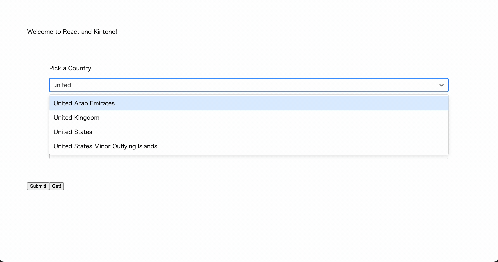

# Build a React App Using Web Database

Let's create a front-end React Component that exchanges the contents of a 3rd party Web Database service using Express as a proxy.

## Completed Project


### Terminal 1

```shell
cd Downloads

git clone https://github.com/kintone-workshops/React-x-REST-API-Workshop

cd React-x-REST-API-Workshop

npm install
```

### Terminal 2

```shell
cd Downloads/React-x-REST-API-Workshop

cd backend && npm install
```

### ⚠️ WARNING ⚠️ <!-- omit in toc -->
⚡ **Node.js v18.16.1** or higher is required to run.  
(The current LTS version is recommended)


Open the `React-x-REST-API-Workshop` folder in [VS Code](https://code.visualstudio.com/docs/getstarted/tips-and-tricks#_command-line) as well:


